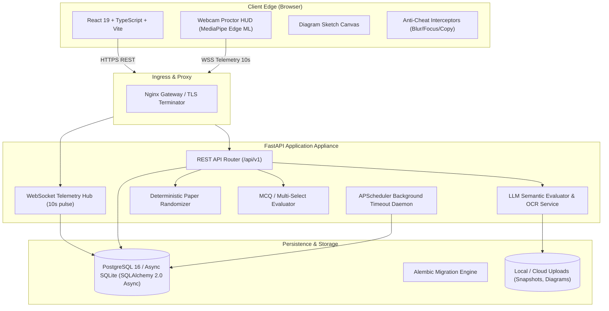

# Examora: Intelligent Examination Platform with Automated Proctoring & Candidate Performance Analysis

<div align="center">

[](https://fastapi.tiangolo.com)
[](https://react.dev)
[](https://www.typescriptlang.org)
[](https://vitejs.dev)
[](https://www.sqlalchemy.org)
[](https://www.postgresql.org)
[](https://www.docker.com)
[]()
[](LICENSE)

<p align="center">
  <strong>An enterprise-grade, high-concurrency online examination and assessment platform powered by Client-Edge AI proctoring, zero-trust server timing, deterministic paper randomization, and LLM-assisted subjective grading.</strong>
</p>

[Key Features](#-key-features) • [System Architecture](#-system-architecture) • [Project Structure](#-project-structure) • [Quickstart Guide](#-quickstart-guide) • [Docker Deployment](#-production-deployment-with-docker) • [Free Cloud Deployment](#-free-cloud-deployment-guide) • [Testing & Benchmarks](#-testing--benchmarking) • [API Documentation](#-api-documentation)

---

</div>

## 🌟 Key Features

### 1. 🛡️ Privacy-Preserving Client-Edge AI Proctoring
- **Edge Vision AI via MediaPipe**: Runs face detection, multi-person recognition, and gaze orientation estimation directly inside the candidate's browser.
- **Strict Privacy**: Raw camera video never leaves candidate devices. Only lightweight numerical vectors (10-second telemetry heartbeat) and violation proof-snapshots are transmitted via WebSockets (`/api/v1/ws/proctor/{id}`).
- **Anti-Cheat Event Interception**: Real-time detection for window blur, tab switching, multiple people in frame, prolonged gaze deflection, and clipboard copy-paste locks.
- **Examiner Mission Control**: Live 3x3 multi-candidate video matrix with real-time incident notifications and candidate drawer inspection.

### 2. ⏱️ Zero-Trust Server-Side Timed Exam Engine
- **Server-Authoritative Clock**: Eliminates client-side clock manipulation. The server records the absolute monotonic deadline upon session initialization.
- **Automated Graceful Finalization**: Embedded **APScheduler** background daemon continuously monitors active sessions, auto-submits, and finalizes scorecards if candidate connectivity is lost when time runs out.

### 3. 🎲 Deterministic Paper Randomization
- **Cryptographic Seed Engine**: Uses `SHA-256(exam_id || student_id)` to derive a candidate-specific pseudo-random sequence.
- **Collusion-Proof**: Guarantees unique question sequences and randomized option ordering per candidate to eliminate screen-peeking, while remaining 100% reproducible across candidate re-connections without database row bloat.

### 4. 🤖 Multi-Modal Questions & AI Subjective Grading Studio
- **Versatile Question Formats**: Single-choice MCQs, Multi-select checkbox questions, Short answer, Extended analytical responses, and Handwritten / Diagram sketch uploads.
- **Interactive HTML5 Sketch Canvas**: Students can draw diagrams and formulas directly in the browser with full stroke and color tools.
- **OCR & LLM-Assisted Evaluation**: OCR extracts handwritten notes, and LLM evaluates subjective responses against model answers and rubric criteria with automated feedback generation.
- **Human-in-the-Loop Review**: Examiners can review AI-suggested marks, adjust scores with custom feedback, and publish cohort results with 1 click.

### 5. 📊 Candidate Scorecards & Cohort Analytics
- Comprehensive student scorecards featuring objective vs. subjective breakdowns.
- Percentile rank distribution curve, question-by-question review, and examiner commentary.
- Cohort-level statistical summaries (Mean, Median, Standard Deviation, Score Quartiles).

---

## 🏗️ System Architecture



### Mathematical Proctoring Suspicion Formulation

Landmark telemetry computes a dynamic cumulative suspicion index $S_t \in [0, 100]$:

$$
S_{t+1} = \min\left(100.0, \max\left(0.0, S_t + \sum_{e \in \text{Events}} \Delta_e\right)\right)
$$

| Violation Event | Penalty ($\Delta_e$) | Trigger Condition |
| :--- | :---: | :--- |
| **Face Absent** | `+12.0` | Candidate absent from webcam viewport |
| **Multiple Faces** | `+25.0` | Additional person detected in camera view |
| **Gaze Deflection** | `+8.0` | Off-screen gaze divergence angle $\ge 0.35$ |
| **Tab / Focus Blur** | `+15.0` | Candidate unfocuses browser or switches tabs |

- **Nominal ($S < 40$)**: Good standing.
- **Warning ($40 \le S < 80$)**: Client HUD warning alert; examiner notification.
- **Flagged ($S \ge 80$)**: Session flagged for integrity review with stored proof snapshot.

---

## 📁 Project Structure

```text
Examora/
├── backend/                        # FastAPI Backend Application
│   ├── app/
│   │   ├── api/v1/endpoints/       # Auth, Exams, Questions, Sessions, Evaluations, Results, WSS
│   │   ├── core/                   # Config, Security, DB session, APScheduler
│   │   ├── models/                 # SQLAlchemy 2.0 Async ORM models
│   │   ├── schemas/                # Pydantic v2 validation models
│   │   └── services/               # Randomizer, Auto-grader, LLM/OCR evaluation
│   ├── tests/                      # Automated Pytest suite & Locust load test
│   ├── alembic/                    # Database schema migration scripts
│   ├── Dockerfile                  # Production container recipe for Backend
│   └── requirements.txt            # Backend Python dependencies
├── frontend/                       # Modern React 19 + TypeScript Application
│   ├── src/
│   │   ├── components/             # Proctor HUD, Mission Control, Sketch Canvas, Grading Studio
│   │   ├── services/               # Typed API & WebSocket client adapters
│   │   ├── types/                  # TypeScript domain interfaces
│   │   └── App.tsx                 # Core application router and role switcher
│   ├── Dockerfile                  # Multi-stage production Nginx container for Frontend
│   └── package.json                # Frontend dependencies (React 19, Vite, MediaPipe)
├── docs/                           # In-depth architectural & deployment guides
│   ├── ARCHITECTURE.md             # Complete technical specification & ER diagram
│   └── FREE_DEPLOYMENT_GUIDE.md    # 100% free cloud deployment guide (Neon + Render + Vercel)
├── scripts/                        # Benchmarks, stress tests, presentation generators
├── docker-compose.yml              # Local multi-service orchestration (DB + API + Web)
├── render.yaml                     # Render Infrastructure-as-Code Blueprint
├── Procfile                        # Production web process runner (Render / Heroku)
├── gunicorn.conf.py                # Enterprise Gunicorn + Uvicorn worker configuration
└── wsgi.py                         # WSGI/ASGI application entrypoint
```

---

## 🚀 Quickstart Guide

### Prerequisites
- **Python**: 3.10 or higher
- **Node.js**: 18.x or higher (with `npm`)
- **Git**

### 1. Clone the Repository
```bash
git clone https://github.com/Anantraj24/Examora.git
cd Examora
```

### 2. Launch the Backend
```bash
# Create and activate virtual environment (optional but recommended)
python -m venv venv
# Windows:
venv\Scripts\activate
# Linux/macOS:
source venv/bin/activate

# Install dependencies
pip install -r requirements.txt

# Start FastAPI development server
python -m uvicorn backend.app.main:app --host 0.0.0.0 --port 8000 --reload
```
- **Backend API**: `http://localhost:8000`
- **Interactive Swagger Docs**: `http://localhost:8000/docs`
- **ReDoc Specification**: `http://localhost:8000/redoc`

### 3. Launch the Frontend
In a new terminal:
```bash
cd frontend
npm install
npm run dev
```
- **Frontend Web App**: `http://localhost:5173`

---

## ⚙️ Environment Variables Reference

Create a `.env` file in the project root or configure in your deployment dashboard:

| Variable | Default Value | Description |
| :--- | :--- | :--- |
| `DATABASE_URL` | `sqlite+aiosqlite:///./exam_platform.db` | Async database URI (`postgresql+asyncpg://...` or SQLite) |
| `SECRET_KEY` | `dev-secret-key-change-in-production` | Secret key for JWT Bearer token generation |
| `ACCESS_TOKEN_EXPIRE_MINUTES` | `1440` (24h) | Auth token expiration window |
| `OPENAI_API_KEY` | *(Optional)* | For GPT-4o / GPT-3.5 subjective answer grading |
| `GEMINI_API_KEY` | *(Optional)* | For Google Gemini subjective grading & OCR analysis |
| `VITE_API_BASE_URL` | `http://localhost:8000/api/v1` | Frontend API target endpoint |
| `VITE_WS_BASE_URL` | `ws://localhost:8000` | WebSocket telemetry host |

---

## 🧪 Testing & Benchmarking

### Automated Test Suite
Examora comes with an automated test suite covering unit validation, state constraints, race conditions, and complete exam lifecycles:
```bash
python -m pytest backend/tests -v -o "pythonpath=backend"
```
```text
backend/tests/test_api.py::test_auth_registration_and_login PASSED
backend/tests/test_api.py::test_exam_creation_and_blueprint PASSED
backend/tests/test_api.py::test_deterministic_paper_randomization PASSED
backend/tests/test_api.py::test_exam_session_lifecycle PASSED
backend/tests/test_api.py::test_mcq_auto_grading PASSED
backend/tests/test_api.py::test_subjective_ai_grading PASSED
backend/tests/test_api.py::test_proctoring_telemetry_flow PASSED
backend/tests/test_api.py::test_cohort_percentile_computation PASSED
...
========================== 10 passed in 2.14s ==========================
```

### High-Concurrency Stress Simulation
Simulate hundreds of simultaneous candidates submitting answers and sending telemetry:
```bash
# Headless async stress simulation
python scripts/stress_test.py

# Distributed load testing with Locust
locust -f backend/tests/locustfile.py --headless -u 50 -r 10 --run-time 1m --host http://localhost:8000
```

---

## 🐳 Production Deployment with Docker

To deploy the full isolated stack (PostgreSQL 16, FastAPI Backend, and Nginx-served React Frontend) with a single command:

```bash
docker compose up --build -d
```

| Service | Port | Description |
| :--- | :--- | :--- |
| **Web Frontend** | `http://localhost:3000` | Nginx Alpine hosting compiled React assets |
| **FastAPI Backend** | `http://localhost:8000` | Uvicorn ASGI application container |
| **PostgreSQL DB** | `localhost:5432` | Postgres 16 Alpine container with persistent volume |

To view logs or stop services:
```bash
docker compose logs -f
docker compose down
```

---

## ☁️ Free Cloud Deployment Guide

You can deploy the complete Examora production platform **100% free with zero credit cards**:

1. **Database**: [Neon.tech](https://neon.tech) — Free serverless PostgreSQL (pooled connection).
2. **Backend API & WebSockets**: [Render.com](https://render.com) — Free Web Service running Python 3 (supports WebSockets natively).
3. **Frontend**: [Vercel](https://vercel.com) — Free global edge CDN for React + Vite.

👉 **Detailed step-by-step instructions available in:** [docs/FREE_DEPLOYMENT_GUIDE.md](docs/FREE_DEPLOYMENT_GUIDE.md)

Alternatively, use the included [`render.yaml`](render.yaml) blueprint to deploy both backend and frontend on Render with one click.

---

## 📖 API Documentation

The platform exposes RESTful endpoints with OpenAPI 3.0 specifications:

| Method | Endpoint | Description | Auth Required |
| :--- | :--- | :--- | :---: |
| `POST` | `/api/v1/auth/register` | Register student, examiner, or administrator | ❌ |
| `POST` | `/api/v1/auth/login` | Authenticate and retrieve JWT Bearer token | ❌ |
| `GET` | `/api/v1/exams/` | List all available examinations | 🔒 |
| `POST` | `/api/v1/exams/` | Create exam with blueprint rules & proctor settings | 🔒 (Examiner) |
| `POST` | `/api/v1/questions/` | Create questions (MCQ, text, diagram, rubric) | 🔒 (Examiner) |
| `POST` | `/api/v1/sessions/start` | Initialize timed exam session & fetch randomized paper | 🔒 (Student) |
| `POST` | `/api/v1/answers/save` | Upsert candidate answer (MCQ, text, sketch data) | 🔒 (Student) |
| `POST` | `/api/v1/sessions/submit-final/{id}` | Finalize exam & trigger objective auto-grade | 🔒 (Student) |
| `WS` | `/api/v1/ws/proctor/{id}` | Real-time candidate proctoring telemetry channel | 🔒 (Student) |
| `WS` | `/api/v1/ws/proctor-monitor` | Live multi-candidate broadcast monitor | 🔒 (Examiner) |
| `GET` | `/api/v1/evaluations/queue` | Subjective grading review queue | 🔒 (Examiner) |
| `POST` | `/api/v1/evaluations/submit-grade` | Examiner subjective grade override & notes | 🔒 (Examiner) |
| `POST` | `/api/v1/evaluations/publish-results/{id}` | Calculate cohort percentiles and publish scores | 🔒 (Examiner) |
| `GET` | `/api/v1/results/student/session/{id}` | Candidate detailed scorecard & breakdown | 🔒 |
| `GET` | `/api/v1/results/cohort-analytics/{id}` | Cohort analytics, metrics, & bell curve | 🔒 (Examiner) |

---

## 📊 Presentation Deck

An enterprise 12-slide project presentation deck conforming to examination review standards is included:
- **`Examora_Final_Presentation.pptx`**
- Re-generate anytime using: `python scripts/generate_presentation.py`

---

## 📄 License

This project is licensed under the **MIT License** — see the [LICENSE](LICENSE) file for details.

---

<div align="center">
  <sub>Engineered with ❤️ for next-generation academic and enterprise examinations.</sub>
</div>
