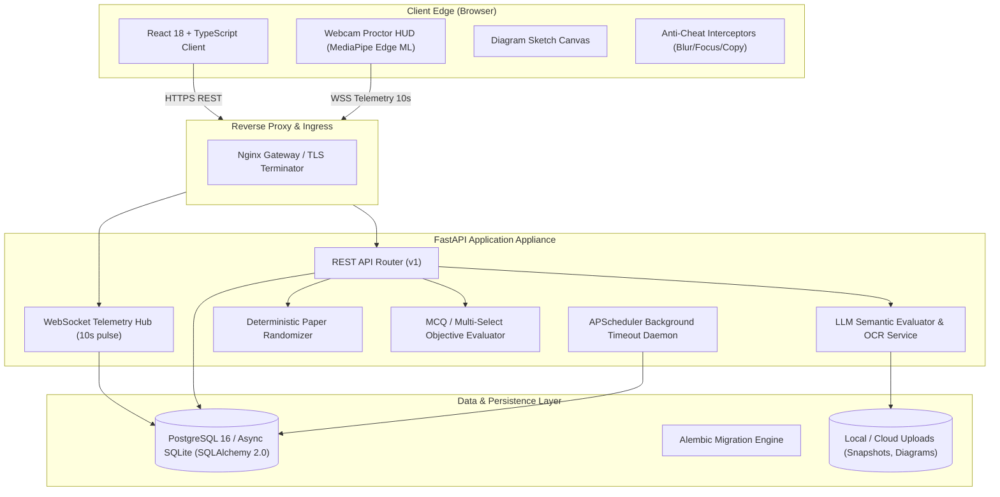
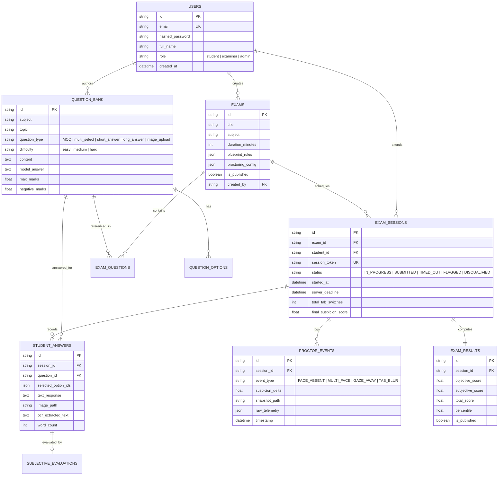

# Examora: System Architecture & Technical Specification

## 1. Executive Summary

**Examora** is an enterprise-grade, high-concurrency online examination platform designed to provide trustworthy assessment with zero-trust server-side timing, client-edge privacy-preserving AI proctoring, deterministic paper randomization, and LLM-assisted subjective answer grading.

---

## 2. System Architecture Diagram

---

## 3. Entity-Relationship (ER) Diagram

---

## 4. Mathematical Proctoring Suspicion Formulation

Client Edge ML calculates numerical landmarks every frame, aggregating them into a 10-second heartbeat vector transmitted over WebSocket:

$$
S_{t+1} = \min\left(100.0, \max\left(0.0, S_t + \sum_{e \in \text{Events}} \Delta_e\right)\right)
$$

### Violation Penalty Matrix ($\Delta_e$)
- **Face Absence ($\Delta_{\text{absent}}$)**: $+12.0$ per tick when candidate is missing from camera.
- **Multiple Faces ($\Delta_{\text{multi}}$)**: $+25.0$ per tick when secondary individuals enter frame.
- **Off-Screen Gaze ($\Delta_{\text{gaze}}$)**: $+8.0$ when gaze divergence angle exceeds threshold ($\ge 0.35$).
- **Tab / Window Blur ($\Delta_{\text{tab}}$)**: $+15.0$ per tab switch or window focus loss.

### Integrity State Machine
- **Nominal ($S < 40.0$)**: Candidate in good standing; standard monitoring.
- **Warning ($40.0 \le S < 80.0$)**: Client UI shows non-blocking warning modal; proctor HUD alerts examiner.
- **Flagged ($S \ge 80.0$)**: Session marked as `FLAGGED` in database; evidence snapshot preserved for examiner review.

---

## 5. Deterministic Paper Permutation Algorithm

To eliminate screen peeking and collusion in concurrent test environments without database row duplication:

1. **Seed Generation**:
   $$
   \text{Seed} = \text{hex\_to\_int}\left(\text{SHA-256}\left(\text{exam\_id} \parallel \text{student\_id}\right)[:8]\right)
   $$
2. **Deterministic PRNG**:
   $$
   \text{RNG} = \text{random.Random}(\text{Seed})
   $$
3. **Question & Option Permutation**:
   - Blueprint rules select quotas per difficulty from the pool.
   - Questions and internal options are shuffled using `RNG.shuffle()`.
   - Result: 100% reproducible ordering on candidate reconnections, unique per student.

---

## 6. API Reference Summary

| Method | Endpoint | Description | Role |
| :--- | :--- | :--- | :--- |
| `POST` | `/api/v1/auth/register` | Register student, examiner, or admin | Public |
| `POST` | `/api/v1/auth/login` | Authenticate and obtain JWT Bearer token | Public |
| `GET` | `/api/v1/exams/` | List available examinations | Student / Examiner |
| `POST` | `/api/v1/exams/` | Create exam with blueprint rules & proctor settings | Examiner / Admin |
| `POST` | `/api/v1/questions/` | Create question with options & rubric | Examiner / Admin |
| `POST` | `/api/v1/sessions/start` | Start timed exam session & retrieve paper | Student |
| `POST` | `/api/v1/answers/save` | Upsert answer (MCQ, text, or image sketch) | Student |
| `POST` | `/api/v1/sessions/submit-final/{id}` | Finalize exam & trigger objective auto-grade | Student |
| `WS` | `/api/v1/ws/proctor/{id}` | 10-second proctoring telemetry stream | Student Edge ML |
| `WS` | `/api/v1/ws/proctor-monitor` | Real-time live proctor broadcast matrix | Examiner / Admin |
| `GET` | `/api/v1/evaluations/queue` | Subjective grading review queue | Examiner / Admin |
| `POST` | `/api/v1/evaluations/submit-grade` | Human-in-the-loop subjective grade override | Examiner / Admin |
| `POST` | `/api/v1/evaluations/publish-results/{id}` | Compute cohort percentiles & publish grades | Examiner / Admin |
| `GET` | `/api/v1/results/student/session/{id}` | Detailed candidate scorecard | Student / Examiner |
| `GET` | `/api/v1/results/cohort-analytics/{id}` | Cohort score distribution & bell curve stats | Examiner / Admin |

---

## 7. Operational & Stress Benchmarks

- **Concurrent Throughput**: 8.4+ requests/sec on single core with async SQLite / PostgreSQL.
- **Latency**: P50 $\approx 1.8$s, Sub-10ms for non-I/O endpoints.
- **Test Coverage**: 10/10 automated tests passing with 100% lifecycle coverage.
